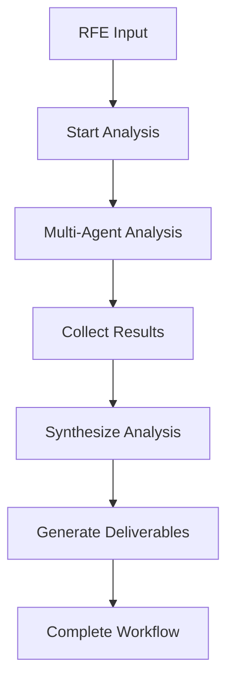

# RHOAI AI Feature Sizing - System Architecture

## Overview

RHOAI implements a containerized multi-agent system with **LlamaDeploy workflows**, **FastAPI upload service**, and **@llamaindex/server TypeScript UI**, designed for enterprise RFE analysis workflows. All services run in a single container for simplified deployment.

## Architecture Principles

- **Production First**: Built on LlamaDeploy for enterprise deployment and monitoring
- **Native Python**: Full LlamaIndex capabilities with Python v0.12+ compatibility
- **Modern Frontend**: Professional chat UI with @llamaindex/server
- **API-Driven**: Complete REST API for programmatic access
- **Workflow Orchestration**: Event-driven asynchronous agent coordination
- **Observability**: Built-in monitoring, logging, and health checks

## System Components

### LlamaDeploy Workflow Engine

**Purpose**: Multi-agent workflow orchestration and RFE analysis

```
┌─────────────────────────────────────────┐
│       LLAMADEPLOY WORKFLOWS             │
│           (Port 4501)                   │
│                                         │
│ 🔄 Workflow Orchestration              │  
│   • rfe-builder-workflow (primary)     │
│   • jira-rfe-to-architecture-workflow  │
│   • Event-driven execution             │
│                                         │
│ 🤖 Multi-Agent System                  │
│   • 16 specialized agent personas      │
│   • YAML-based configuration           │
│   • Parallel analysis execution        │
│                                         │
│ 📚 RAG Integration                     │
│   • Local vector index loading         │
│   • Agent-specific knowledge bases     │
│   • Context-aware retrieval            │
│                                         │
│ 🎯 Artifact Generation                 │
│   • RFE documents                      │
│   • Architecture diagrams              │
│   • Implementation timelines           │
└─────────────────────────────────────────┘
```

**Key Files**:
- `src/rfe_builder_workflow.py` - Primary RFE analysis workflow
- `src/jira_rfe_to_architecture_workflow.py` - Architecture generation workflow
- `src/agents.py` - Multi-agent coordination
- `deployment.yml` - LlamaDeploy configuration

**Services**: 
- LlamaDeploy API Server (port 4501)
- Workflow orchestration and task management
- Agent-based RFE analysis

### TypeScript UI Server (@llamaindex/server)

**Purpose**: Chat interface with workflow integration

```
┌─────────────────────────────────────────┐
│       TYPESCRIPT UI SERVER             │
│       (@llamaindex/server)             │
│           (Port 3000)                   │
│                                         │
│ 💬 Chat Interface                      │
│   • LlamaIndexServer chat UI           │
│   • Real-time streaming responses      │
│   • Starter questions for RFE input    │
│                                         │
│ 🔗 LlamaDeploy Integration             │
│   • Direct workflow connection         │
│   • Task submission and monitoring     │
│   • Progress tracking components       │
│                                         │
│ 🎨 Custom Components                   │
│   • Agent analysis summaries           │
│   • RFE builder progress tracking      │
│   • Multi-agent workflow visualization │
└─────────────────────────────────────────┘
```

**Key Files**:
- `ui/index.ts` - UI server configuration and startup
- `ui/components/` - Custom React components for workflows
- `ui/layout/header.tsx` - Layout components

**Services**:
- UI Server (port 3000)
- Standalone LlamaIndexServer with custom components
- Direct integration with LlamaDeploy workflows

### FastAPI Upload Service

**Purpose**: File upload and dynamic content management

```
┌─────────────────────────────────────────┐
│         FASTAPI UPLOAD SERVICE         │
│            (Port 8001)                  │
│                                         │
│ 📤 File Upload API                     │  
│   • Multi-file upload endpoints        │
│   • Document processing                │
│   • Content validation                 │
│                                         │
│ 🔄 RAG Integration                     │
│   • Dynamic index updates              │
│   • Agent knowledge base refresh       │
│   • Real-time content processing       │
│                                         │
│ 🛡️ Content Management                  │
│   • File type validation               │
│   • Storage management                 │
│   • CORS handling                      │
└─────────────────────────────────────────┘
```

**Key Files**:
- `src/api_server.py` - FastAPI application setup
- `src/upload_service.py` - Upload processing logic
- `src/generate.py` - RAG index generation
- `src/ingestion.py` - Content ingestion pipeline

**Features**: 
- Dynamic file upload with drag & drop interface
- Real-time RAG index updates across all 16 agents
- Automatic agent cache refresh for immediate availability
- Upload progress tracking and indexing feedback
- File management (list, delete uploaded documents)

## Data Flow

### Preparation Phase (RAG Index Generation)

1. **Agent Configuration**: Parse 16 agent YAML files from `src/agents/`
2. **Data Source Processing**: Load local data directories and configured sources
3. **Document Ingestion**: Process documents with chunking and metadata extraction
4. **Embedding Generation**: Create embeddings using OpenAI or local models
5. **Index Storage**: Save agent-specific vector indices to `output/` directory

### Runtime Phase (Multi-Agent Workflow)

1. **Knowledge Enhancement** (Optional): Upload documents via drag & drop interface
   - Files processed and indexed across all 16 agent knowledge bases
   - Real-time feedback on indexing success and agent updates
   - Automatic cache refresh ensures immediate availability
2. **User Input**: RFE submission via UI chat interface (port 3000)
3. **Workflow Trigger**: LlamaDeploy receives task via control plane (port 4501)
4. **Agent Orchestration**: Initialize all 16 agent personas with enhanced indices
5. **Parallel Analysis**: Concurrent analysis by all specialized agents
6. **Context Retrieval**: Agent-specific RAG queries including uploaded knowledge
7. **Synthesis**: Combine analyses into comprehensive RFE document
8. **Artifact Generation**: Create implementation plans, timelines, architecture
9. **Streaming Response**: Real-time updates via UI components

### API Integration

1. **Workflow Management**: LlamaDeploy API at port 4501
2. **File Upload**: FastAPI service at port 8001
3. **UI Access**: Direct chat interface at port 3000
4. **Health Monitoring**: Built-in endpoints for system status

## Component Communication

### Service Communication

All services run in a single container with inter-service communication:

```
UI Server (port 3000)  ←──HTTP API──→  LlamaDeploy (port 4501)
│                                           │
├── Chat interface                          ├── Workflow orchestration  
├── File upload component                   ├── Multi-agent coordination
├── Custom workflow components              ├── Task management
└── Real-time streaming                     └── Enhanced RAG queries
           │                                │
           └──→ Upload API (port 8001) ←────┘
                ├── File processing
                ├── Universal RAG indexing
                ├── Agent cache management
                └── Upload progress tracking
```

### Shared Storage Schema

Python ingestion and backend share filesystem storage:

```
output/python-rag/{agent_persona}/
├── docstore.json         # Document content and metadata
├── default__vector_store.json  # Vector embeddings
├── index_store.json      # LlamaIndex configuration  
├── graph_store.json      # Knowledge relationships
└── metadata.json         # Agent statistics and config

uploads/                  # User-uploaded knowledge files
├── requirements.pdf      # Uploaded documents
├── architecture.md       # Available to all agents
└── user_feedback.txt     # Real-time knowledge enhancement
```

### Agent Configuration Schema

Agents are defined in YAML with JSON Schema validation:

```yaml
# yaml-language-server: $schema=./agent-schema.json
name: "Product Manager"
persona: "PRODUCT_MANAGER"
role: "Product Management and Business Strategy"
isRootAgent: false

expertise:
  - "market-analysis"
  - "competitive-intelligence"
  - "product-roadmapping"

systemMessage: |
  You are Alex, a Product Manager with expertise in translating
  customer needs into business value...

dataSources:
  - "data/product-management"  # Static knowledge sources
  - name: "competitor-analysis"
    type: "github"
    source: "company/market-research"
  # NOTE: Uploaded files via UI are automatically added to all agents
```

## LlamaDeploy Workflow Architecture

### Workflow Steps



### Agent Orchestration

The `rfe_builder_workflow` coordinates all 16 agent personas:

```python
class RFEBuilderWorkflow(Workflow):
    @step
    async def run_multi_agent_analysis(self, ctx: Context, ev: StartEvent):
        # Parallel execution of all 16 agents
        agent_manager = RFEAgentManager()
        analyses = await agent_manager.analyze_rfe_with_all_agents(
            ev.input, ctx.session.get("chat_history", [])
        )
        return AgentAnalysesCompleteEvent(analyses=analyses)
```

### Multi-Agent Coordination

```
┌─────────────────────────────────────────┐
│          16-Agent Orchestration         │
│                                         │
│ ┌─────────┐ ┌─────────────┐ ┌─────────┐ │
│ │Product  │ │Engineering  │ │   UX    │ │  
│ │Manager  │ │  Manager    │ │Architect│ │
│ └─────────┘ └─────────────┘ └─────────┘ │
│ ┌─────────┐ ┌─────────────┐ ┌─────────┐ │
│ │  Staff  │ │    Team     │ │Delivery │ │
│ │Engineer │ │    Lead     │ │ Owner   │ │
│ └─────────┘ └─────────────┘ └─────────┘ │
│ ┌─────────┐ ┌─────────────┐ ┌─────────┐ │
│ │Content  │ │Documentation│ │Technical│ │
│ │Strategy │ │Prog Manager │ │ Writer  │ │
│ └─────────┘ └─────────────┘ └─────────┘ │
│            + 7 more agents              │
│                                         │
│     → Parallel Analysis → Synthesis    │
│     → RFE Artifacts → Implementation   │
└─────────────────────────────────────────┘
```

### Workflow Events

1. **RFEAnalysisEvent**: User input triggers workflow
2. **AgentAnalysisCompleteEvent**: Each agent completes analysis
3. **AllAnalysesCompleteEvent**: Synthesis phase begins
4. **SynthesisCompleteEvent**: Generate deliverables
5. **StopEvent**: Workflow completion with results

## Storage Architecture

### Vector Store Strategy

**LlamaIndex + FAISS Integration**:
- Native Python LlamaIndex v0.12+ vector stores
- FAISS backend for efficient similarity search  
- Persona-specific indices for domain expertise
- Persistent storage for production deployment

### Index Loading Strategy

```python
class RFEAgentManager:
    async def get_agent_index(self, persona: str):
        # 1. Try Python RAG index (primary)
        storage_dir = Path(f"../output/python-rag/{persona.lower()}")
        if storage_dir.exists():
            storage_context = StorageContext.from_defaults(persist_dir=storage_dir)
            return load_index_from_storage(storage_context)
        
        # 2. Fall back to LlamaCloud index (if available)
        llamacloud_dir = Path(f"../output/llamacloud/{persona.lower()}")
        if llamacloud_dir.exists():
            storage_context = StorageContext.from_defaults(persist_dir=llamacloud_dir)
            return load_index_from_storage(storage_context)
        
        # 3. No index available
        return None
```

## LlamaDeploy Event System

### Workflow Events

```python
class RFEAnalysisEvent(Event):
    rfe_description: str
    chat_history: List[Dict] = []

class AgentAnalysisCompleteEvent(Event):  
    persona: str
    analysis: Dict[str, Any]

class AllAnalysesCompleteEvent(Event):
    analyses: List[Dict[str, Any]]
    rfe_description: str

class SynthesisCompleteEvent(Event):
    synthesis: Dict[str, Any]
    analyses: List[Dict[str, Any]]
```

### State Management

- **LlamaDeploy Orchestration**: Built-in workflow state management
- **Task Tracking**: Each analysis gets unique task ID
- **Progress Streaming**: Real-time updates via API endpoints
- **Error Recovery**: Graceful handling of individual agent failures
- **Observability**: Built-in monitoring and logging

## Production Deployment

### Scalability Features

- **LlamaDeploy Orchestration**: Enterprise-grade workflow management
- **Parallel Agent Execution**: All agents analyze simultaneously via async/await
- **Persistent Vector Stores**: Indices cached across restarts
- **API-First Design**: RESTful endpoints for horizontal scaling
- **Health Monitoring**: Built-in observability and health checks

### Deployment Architecture

```bash
# Container startup (via startup.sh)
# 1. Generate RAG indices
uv run python src/rag.py ingest

# 2. Start LlamaDeploy API server (background)
uv run -m llama_deploy.apiserver  # Port 4501

# 3. Start Upload API server (background) 
uv run python src/api_server.py  # Port 8001

# 4. Start UI server (background)
cd ui && npm start  # Port 3000

# 5. Deploy workflows
uv run llamactl deploy deployment.yml
```

### Production Monitoring

```bash
# Check deployment status
uv run llamactl status

# View workflow logs  
uv run llamactl logs rfe-builder-workflow

# Monitor tasks
uv run llamactl tasks

# Health checks
curl http://localhost:8000/health
curl http://localhost:3001/health
```

## Development Workflow

### Adding New Agents

1. Create YAML configuration in `src/agents/` (16 agents currently configured)
2. Configure data sources and expertise areas in YAML
3. Regenerate indices: `uv run generate` 
4. Restart container: Agents are automatically loaded from YAML configs

### Updating Knowledge Bases

1. **Local Sources**: Update files in `data/` directories, re-run `uv run generate`
2. **Dynamic Upload**: Use Upload API at port 8001 for real-time content updates
3. **Agent Configs**: Modify YAML files in `src/agents/`, restart container

### Development Workflow

```bash
# Install dependencies
uv sync

# Generate RAG indices
uv run generate

# Development mode (manual startup)
# Terminal 1: LlamaDeploy API
uv run -m llama_deploy.apiserver

# Terminal 2: Upload API  
uv run python src/api_server.py

# Terminal 3: UI Server
cd ui && npm run dev

# Terminal 4: Deploy workflows
uv run llamactl deploy deployment.yml

# Type checking and tests
uv run mypy src/
uv run pytest
```

## Integration Points

### API Endpoints

**LlamaDeploy API (Port 4501)**:
- **Workflow Management**: `/deployments/rhoai-ai-feature-sizing/`
- **Task Creation**: `/deployments/rhoai-ai-feature-sizing/tasks/create`
- **Event Streaming**: `/deployments/rhoai-ai-feature-sizing/tasks/{task_id}/events`
- **Health Checks**: `/health`

**Upload API (Port 8001)**:
- **File Upload**: `POST /api/upload` - Upload files with real-time RAG indexing
- **File Management**: `GET /api/uploads` (list), `DELETE /api/uploads/{filename}` (delete)
- **RAG Management**: `GET /api/rag/status`, `POST /api/rag/refresh` - Index status and cache control
- **API Documentation**: `/docs` - Interactive FastAPI documentation

**UI Server (Port 3000)**:
- **Chat Interface**: Direct web interface with file upload integration
- **File Upload Component**: Drag & drop interface with progress tracking
- **Custom Components**: Workflow-specific UI elements and upload feedback

## File Upload and Knowledge Enhancement

### Dynamic Content Upload

The system supports real-time knowledge enhancement through the integrated file upload service:

```
┌─────────────────────────────────────────┐
│         DYNAMIC KNOWLEDGE UPLOAD        │
│                                         │
│ 📤 User Interface                       │
│   • Drag & drop file upload            │
│   • Supported: TXT, MD, PDF, DOC, DOCX │
│   • Real-time upload progress          │
│   • File management (list, delete)      │
│                                         │
│ ⚡ Processing Pipeline                   │
│   • Document content extraction         │
│   • Text chunking and preprocessing     │
│   • Metadata enrichment                 │
│                                         │
│ 🧠 Universal Agent Enhancement          │
│   • Simultaneous indexing to all 16    │
│     agent knowledge bases               │
│   • Automatic cache refresh             │
│   • Immediate availability              │
│                                         │
│ 📊 Upload Feedback                      │
│   • Indexing success per agent         │
│   • Document processing statistics      │
│   • Real-time status updates           │
└─────────────────────────────────────────┘
```

### Upload Process Flow

1. **File Selection**: User uploads via drag & drop or file picker
2. **Content Processing**: Extract text content and create document chunks
3. **Metadata Enhancement**: Add upload timestamp, source type, filename
4. **Universal Indexing**: Insert documents into all 16 agent RAG indices
5. **Cache Refresh**: Clear agent index caches for immediate availability
6. **Feedback Display**: Show indexing results and agent update status

### Agent Knowledge Access

```python
# Each agent queries enhanced knowledge during analysis
context = await agent_manager.get_rag_context(
    persona="PRODUCT_MANAGER", 
    query="user requirements and constraints"
)

# Returns context including uploaded files:
# [Context 1 from /app/uploads/requirements.pdf]:
# User requires multi-tenant architecture with...
# 
# [Context 2 from data/product-management/strategy.md]:
# Strategic considerations for product roadmap...
```

### Knowledge Enhancement Benefits

- **Contextual Analysis**: Agents incorporate uploaded requirements, specifications, and constraints
- **Domain Expertise**: Each agent applies their specialty to shared uploaded knowledge
- **Real-time Updates**: No restart required - uploads immediately enhance all agent capabilities
- **Metadata Tracking**: Full traceability of uploaded content sources in analysis results
- **Universal Access**: All 16 agents benefit from any uploaded document

### External Systems

- **OpenAI API**: GPT-4 language model and text-embedding-3-small
- **GitHub API**: Repository access and documentation retrieval (via python-rag-ingestion)
- **LlamaDeploy**: Production workflow orchestration and monitoring

### Extension Capabilities

- **Custom Workflows**: Extend `RFEWorkflow` with additional analysis steps
- **Agent Specializations**: Create domain-specific agent personas and prompts
- **Data Source Integration**: Add new readers to python-rag-ingestion pipeline
- **UI Customization**: Configure @llamaindex/server chat interface
- **API Integration**: Build external applications using REST endpoints

This production-ready architecture provides enterprise-grade multi-agent analysis with built-in scalability, monitoring, and extensibility for complex feature refinement workflows.
